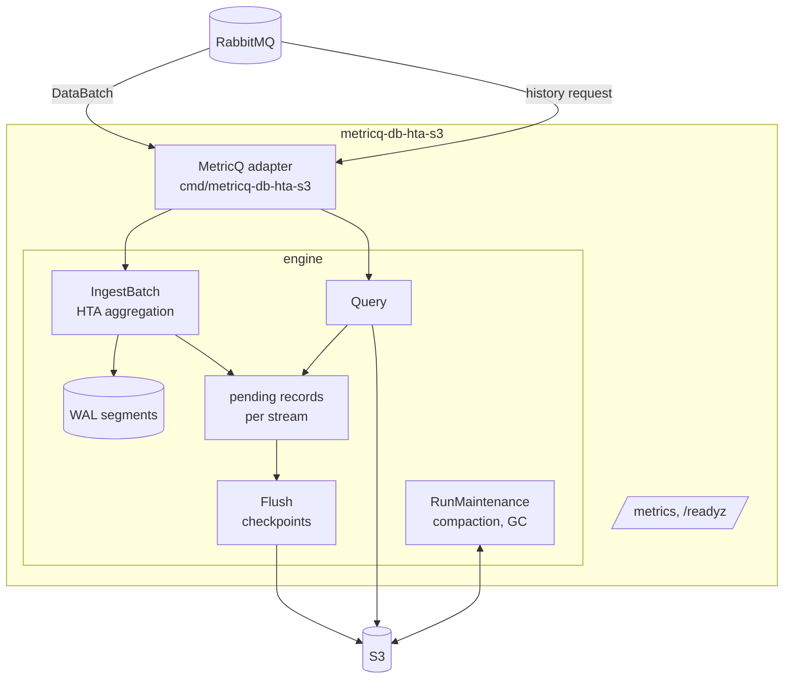

# Components

The executable `metricq-db-hta-s3` wires a MetricQ database client to a
storage engine. Everything that touches data lives in the `engine` package.

| Component | Responsibility |
| --- | --- |
| MetricQ adapter (`cmd/metricq-db-hta-s3`) | Registers the database with the manager, receives the metric configuration, maps incoming metric names to stored metric names, passes batches of data deliveries to the engine, answers history requests, serves Prometheus metrics. |
| `metricq-go` `DB` client | AMQP connections, prefetch, batched data consumption with one multiple ACK per batch, parallel history workers. |
| Ingest (`IngestBatch`) | Validates samples, runs the HTA aggregation, appends one WAL frame per data delivery and fsyncs once per batch, then publishes the new state in memory. |
| WAL (`wal.go`) | Local, checksummed log of accepted data deliveries. Each WAL frame is one log entry; each WAL segment is a file containing one or more frames. Acknowledged samples survive a crash until a checkpoint stores them. |
| Checkpoint (`Flush`) | Writes pending records as data blocks and index pages to S3, persists held records as deltas, publishes a new manifest, releases WAL segments. |
| Query | Reads the index of one metric level and the needed data blocks, plus unflushed records in memory. |
| Maintenance (`RunMaintenance`) | Compaction (merging small blocks, level locality, reclaiming partly dead objects), deletion of retired objects, recovery of interrupted jobs. |

## Concurrency

- **`e.mu`** (the ingestion mutex) protects the in-memory state: HTA series,
  pending records, WAL append, committed manifest. Ingestion holds it for CPU
  work and one fsync; queries hold it only to take a snapshot.
- **`publishMu`** serializes publications of a new manifest: checkpoints,
  compaction publication and garbage collection. Object store I/O happens
  under `publishMu` but not under `e.mu`, so a slow S3 does not block
  ingestion or queries until the WAL fills.
- **`maintenanceMu`** serializes maintenance jobs; there is one compaction or
  reclamation at a time.

A checkpoint takes `e.mu` only to freeze its records and rotate the WAL
segment, and again to install the result. Queries pin the manifest generation
they started with; objects retired later are not deleted while such a query
runs.

## Single writer

Exactly one process may own a bucket prefix. A local file lock prevents two
processes from using the same WAL directory, and the conditional manifest PUT
fences a second writer on the same prefix: the loser stops with a conflict
error instead of overwriting.
