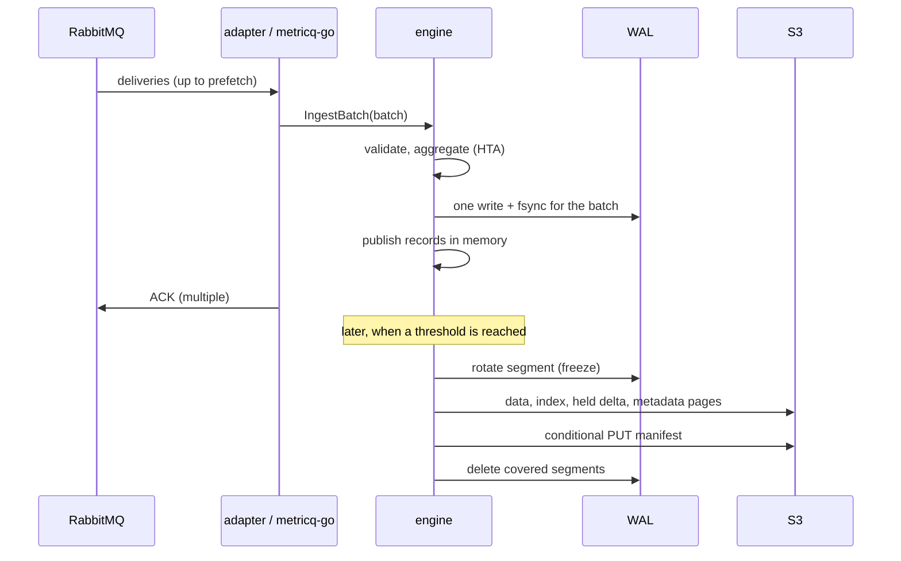

# Write path

## Ingest and group commit

The `metricq-go` client takes one delivery and every delivery that RabbitMQ
has already prefetched (waiting at most 500 µs, bounded by the prefetch count
and 16 MiB) and hands them to the engine as one batch. `IngestBatch`:

1. decodes each chunk and runs the HTA aggregation on a copy of the metric's
   state (several deliveries of one metric chain their states);
2. encodes one WAL frame per delivery with its own sequence number;
3. checks WAL and ingest memory limits cumulatively — if they are exceeded it stops
   and returns the number of deliveries processed;
4. writes all frames with one write and one fsync;
5. only then publishes the new HTA states and records.

The adapter acknowledges the whole batch with one multiple ACK after the
engine returned. If a limit was hit, it runs a checkpoint and retries the
remainder; nothing is acknowledged before it is durable. Throughput is
therefore mostly bounded by CPU, not by fsync latency.

## WAL

The WAL directory contains the active segment `ingest.wal`, frozen segments
`ingest.wal.<last sequence>`, a `lock` file, the backend `identity` and the
last local `checkpoint`. Frames carry a sequence number, length and CRC32C
checksums. On startup the engine replays all frames after the manifest's
sequence. A torn or corrupt frame stops startup instead of discarding data
(see [Troubleshooting](../operations/troubleshooting.md#wal-does-not-replay)).

## Checkpoints

A checkpoint (`Flush`) runs when one of these is reached:

| Trigger (`reason` label) | Condition |
| --- | --- |
| `wal` | active WAL segment ≥ `wal_target_bytes` |
| `object_target` | records only in the WAL ≥ `checkpoint_unsaved_bytes` (estimated) |
| `hold_budget` | held records > `hold_memory_bytes` |
| `hold_age` | a stream's oldest held record is older than `hold_max_age_seconds` (checked every `hold_expiry_interval_seconds`) |
| `explicit` | backpressure during ingest, or shutdown |

Steps:

1. **Freeze** (under the ingestion lock): decide per stream which records to
   write, rename the active WAL segment, and remember the HTA state that
   belongs to the frozen WAL sequence.
2. **Upload** (without the lock, ingestion and queries continue): encode blocks
   in parallel, write one `data/` pack and one `index/` pack, a `held/` delta,
   changed metadata pages, catalog updates.
3. **Publish**: conditional PUT of `manifest`. If the response is lost, the
   engine reads the manifest back and continues only if it matches.
4. **Install** (under the lock): new roots become visible to queries, written
   records leave memory, covered WAL segments are deleted.

If any step fails, nothing is released: records return to the pending set and
the WAL segment stays for the next attempt.

## Holding streams

Writing every stream at every checkpoint creates tiny blocks for low-rate
metrics and rewrites the index of every stream each time. With
`hold_max_age_seconds > 0` (the default of the executable, one hour) a checkpoint
writes a stream only

- in complete 1024-record blocks,
- completely, once its oldest held record is older than `hold_max_age_seconds`,
- completely, largest streams first, while held records exceed `hold_memory_bytes`.

The remaining records stay in memory — queries read them there — and are
persisted as one `held/` delta per checkpoint, containing only records not
already in an earlier delta. The WAL can therefore be released after every
checkpoint. A delta is retired once no stream needs its records. After a
restart the engine loads the listed deltas, skips records at or before each
stream's watermark (its last written record) and replays the WAL.

Effect for 1500 metrics at mixed rates: new small blocks drop from about 290
to about 3 per second and object store writes from 4.3 GB to 0.46 GB per hour
(see `measurements/hold-back.md`).

## Append-only aggregates

Checkpoints append new blocks and never rewrite the last partial block of a
stream (`checkpoint_append_only_aggregates`, default on in the executable). Partial
blocks are merged later by compaction. With compaction disabled the engine
falls back to reading and extending the last aggregate block at each
checkpoint.
