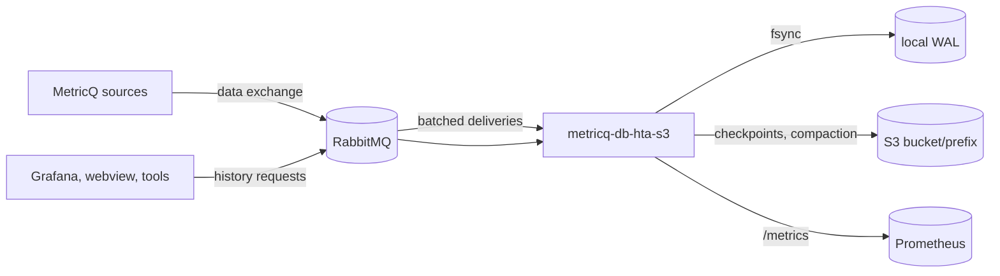

# metricq-db-hta-s3

`metricq-db-hta-s3` is a [MetricQ](https://github.com/metricq/metricq) history
database. It receives data points for metrics from MetricQ sources over AMQP,
aggregates them into the HTA hierarchy (hierarchical timeline aggregation) and stores them as
immutable objects in S3-compatible object storage. It answers all MetricQ
history request types, including `FLEX_TIMELINE`, and is a drop-in
replacement for the file-based C++ `metricq-db-hta` for the same manager
configuration.

Properties that shape its operation:

- **Durable before acknowledged.** A delivery is acknowledged only after its
  samples are fsynced to the local write-ahead log (WAL).
- **Object storage is the database.** Data, indexes and metadata are immutable
  objects; a single conditionally written `manifest` object commits a new
  state. A restart needs only the bucket prefix and the local WAL.
- **Aggregates are precomputed.** Every metric has a raw level and a chain of
  aggregate levels; a `FLEX_TIMELINE` request reads one level only.
- **Background maintenance.** Compaction merges small blocks and lays out each
  metric level contiguously; garbage collection deletes retired objects.
- **Observable.** A Prometheus endpoint exposes every limit and backlog, and a
  Grafana dashboard selects a database by its MetricQ token.

## Where to start

| You want to | Read |
| --- | --- |
| Run it | [Deployment](operations/deployment.md), [Configuration](operations/configuration.md) |
| Check your S3 and plan capacity | [Requirements](operations/requirements.md), [Sizing](operations/sizing.md) |
| Understand a dashboard panel or alert | [Monitoring](operations/monitoring.md) |
| Fix backpressure, slow queries or backlog | [Tuning](operations/tuning.md), [Troubleshooting](operations/troubleshooting.md) |
| Understand the design | [Architecture](architecture/overview.md) |
| Change the code | [Code structure](development/code-structure.md), [Testing](development/testing.md) |

The [data model](architecture/data-model.md) defines the terms used for MetricQ
data points and the database's internal records, streams, blocks and WAL files.

Benchmark reports and the design history are kept outside this site, in the
`measurements/` directory of the repository.
