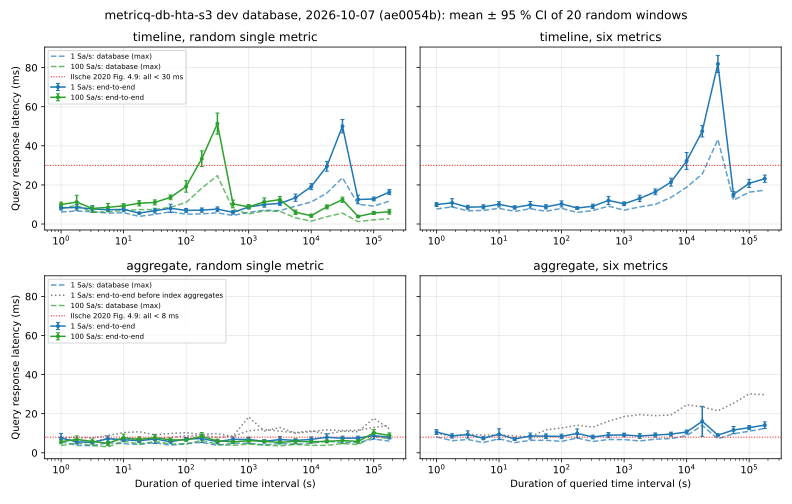
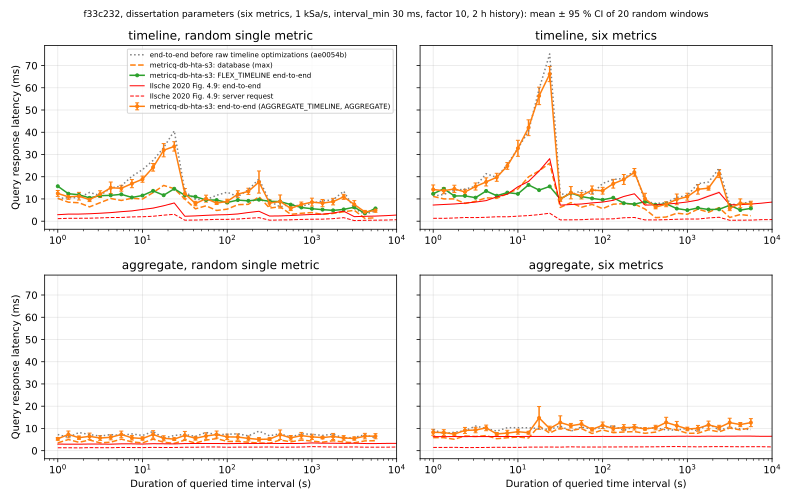
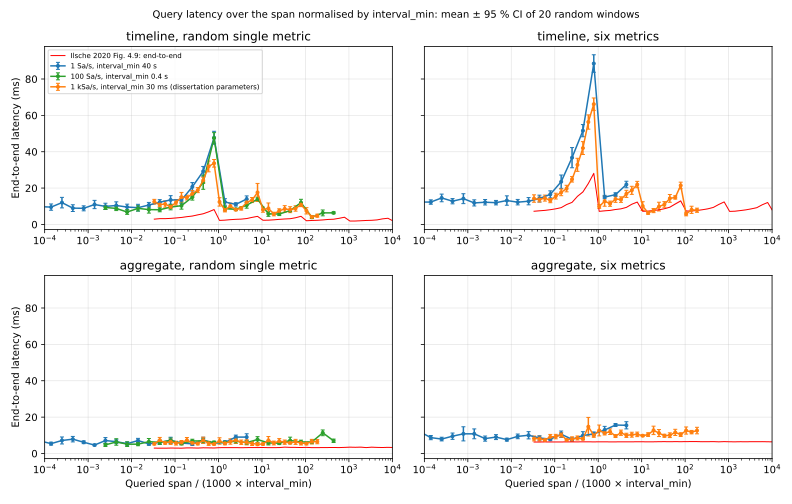

# Ingest and query performance of the development database, 2026-10-07

Measured three times on the MetricQ development stack: first with `8c00bd2`;
then with `ae0054b`, which stores aggregates in index entries and answers
single aggregates from them (both with metricq-go `6642e63`); finally with
`f33c232`, which speeds up raw timelines with a faster gzip, compact data
blocks and directly encoded responses (metricq-go `e919095`). RabbitMQ, local
RustFS and the database run in Docker on one laptop (AMD Ryzen 7 PRO 4750U,
8 cores, 29 GB RAM; WAL on the internal SSD). The database had run for days
with compaction, so its layout was converged: fragmentation ratio 2.0-2.5,
about 1800 objects. Reference values are from Thomas Ilsche, *Energy
Measurements of High Performance Computing Systems* (2020), §4.3.2 and
§4.3.5, measured with the C++ HTA on Xeon E5-2620 v4 nodes with one NVMe SSD
per metric and InfiniBand.

## Ingest

| Scenario | `8c00bd2` | `ae0054b` | `f33c232` | Reference |
| --- | ---: | ---: | ---: | --- |
| Catch-up after a 10-minute stop: about 604,000 queued messages, 1 sample each, about 1000 metrics, prefetch 400 | 26,000-29,000 samples/s | 23,000-29,000 samples/s | **25,000-28,000 samples/s** | production file DB on NFS in the same situation: about 25,000 samples/s |
| Six metrics, 500-sample chunks, 1 million samples each, prefetch 400 | 364,459 samples/s | 370,644 samples/s | **343,641 samples/s** | — |
| same, prefetch 2000 | 361,551 samples/s | 371,774 samples/s | 401,243 samples/s | — |
| Dissertation, six channels, large chunks, prefetch 400 | — | — | — | 21.0 MSa/s (Fig. 4.6) |

The catch-up run is the production-like case: after starting, the database
needs a few seconds for registration and subscription (about 10 s before,
4 s with `f33c232`), then drains at a constant rate
([catchup.csv](perf-2026-10-07/catchup.csv), earlier runs
[ae0054b](perf-2026-10-07/catchup-ae0054b.csv) and
[8c00bd2](perf-2026-10-07/catchup-8c00bd2.csv); queue depths from the
RabbitMQ API update every 5 s, rates come from
`metricq_db_ingest_samples_total`). The queue was empty after 31 s with
`f33c232`, 37-41 s before. One message per sample makes the rate a message
rate; before group commit and the binary WAL frames it peaked at
2,000-2,500 samples/s. The chunked rates vary by about ±10 % between runs;
neither the block aggregates (`ae0054b`) nor the new block format changed
them measurably.

The chunked run uses `TestIngestThroughput` (integration tag) with its own
engine against a separate RustFS: RabbitMQ delivery, WAL fsync, aggregation
and S3 checkpoints, without hold or compaction
([ingest-chunks.csv](perf-2026-10-07/ingest-chunks.csv), earlier runs
[ae0054b](perf-2026-10-07/ingest-chunks-ae0054b.csv) and
[8c00bd2](perf-2026-10-07/ingest-chunks-8c00bd2.csv)). That is about 3 times the
117,666 samples/s measured when group commit was introduced
([ingest-group-commit.md](ingest-group-commit.md)). The dissertation's
21 MSa/s used a C++ implementation with much larger chunks on server
hardware and local file storage; the numbers mark the order of magnitude,
not a like-for-like comparison.

## Query latency

The matrix follows §4.3.5: aggregate timelines with at least 1000 intervals
(`AGGREGATE_TIMELINE`, `interval_max` = span / 1000) and single aggregates,
for one random metric or six random metrics in parallel, 20 random windows
per configuration, spans on a logarithmic scale (four per decade). Latency
is end-to-end in a Go client through RabbitMQ; the database time is the
`x-request-duration` of the slowest response
([query-matrix.go](perf-2026-10-07/query-matrix.go)). Two data sets of the
running database:

- 1000 load metrics at 1 Sa/s, `interval_min` 40 s, spans 1 s to 178,000 s
  ([query-matrix-1sa.csv](perf-2026-10-07/query-matrix-1sa.csv), earlier
  runs [ae0054b](perf-2026-10-07/query-matrix-1sa-ae0054b.csv) and
  [8c00bd2](perf-2026-10-07/query-matrix-1sa-8c00bd2.csv));
- `dummy.source.hta-s3` at 100 Sa/s, 40 million samples, `interval_min`
  0.4 s, single metric ([query-matrix-100sa.csv](perf-2026-10-07/query-matrix-100sa.csv),
  earlier runs [ae0054b](perf-2026-10-07/query-matrix-100sa-ae0054b.csv) and
  [8c00bd2](perf-2026-10-07/query-matrix-100sa-8c00bd2.csv)).

Windows up to 75,000 s lie in the last 21 hours, which have no gaps; longer
ones lie in the last 60 hours and include gaps of the development stack.
Each request picks a random metric of 1000, so most data blocks are read
from S3. The first run started on a database running for hours, the later
ones 15 minutes after a restart. The chart shows `f33c232`.

The red lines in the chart are the dissertation's measurements: the
end-to-end mean with its 95 % confidence band and the server request time,
which corresponds to the database time here. They were read from the
vector paths of Figure 4.9 (57 spans from 1 s to 10⁷ s per series, axes
calibrated by the tick marks; [ilsche-2020-fig-4.9.csv](perf-2026-10-07/ilsche-2020-fig-4.9.csv)).

| Query | Metrics | Dissertation end-to-end (server request) | `8c00bd2` mean | `ae0054b` mean (database) | `f33c232` mean (database) | Data range requests (`f33c232`) |
| --- | ---: | --- | --- | --- | --- | ---: |
| Timeline | 1 | 1.8-4.5 ms; up to 8.2 ms at 10-24 s spans, raw values (0.1-3.1 ms) | 6-14 ms; 22-54 ms where 10,000-31,600 raw values are returned | 6-20 ms; 30-50 ms at 17,800-31,600 raw values (4-24 ms) | 8-21 ms; 29-48 ms at 17,800-31,600 raw values (7-22 ms) | 0.9-1.2 |
| Timeline | 6 | 7.1-12.9 ms; up to 28.1 ms at 10-24 s spans (0.2-3.6 ms) | 8-24 ms; 32-79 ms at 60,000-190,000 raw values | 8-23 ms; 32-82 ms (6-43 ms) | 12-24 ms; 37-89 ms (9-38 ms) | 5.7-7.3 |
| Aggregate | 1 | 2.9-3.5 ms (1.2-1.8 ms) | 6-18 ms, growing with the span | **5.3-8.8 ms, flat** (3.6-7.0 ms) | 4.6-9.0 ms (2.8-7.0 ms) | 0.9-2 |
| Aggregate | 6 | 6.3-6.5 ms (1.4-2.0 ms) | 8-30 ms, growing with the span | **7-16 ms, flat**, mostly 8-10 ms (5.2-14 ms) | 7.6-15.7 ms (5.4-13.6 ms) | 5.7-12 |
| Aggregate, 100 Sa/s | 1 | as above | 8-18 ms | **4.8-10 ms** (3.0-8.4 ms) | 4.7-11.4 ms (3.0-9.4 ms) | 0.7-1.9 |

Database time is about half to two thirds of the end-to-end latency; the
rest is RabbitMQ transfer and client decoding. In the dissertation the
server request took well under half, and the C++ HTA answered in 0.1-3.6 ms
from local SSDs.

Timelines show the pattern described in the dissertation: while the
requested resolution is finer than `interval_min`, raw values are returned
and latency grows with the result size (up to 40 × 1000 values here, 30 ×
1000 in the dissertation's configuration); beyond that, aggregate levels
bound it again, with a sawtooth at every factor 10 of the span. Outside the
peaks timelines take 6-20 ms against 1.8-12.9 ms in the dissertation. The raw
peaks are much higher: 50 ms against 8.2 ms for one metric and 82 ms against
28.1 ms for six. There the database itself needs 24-43 ms to read, decode
and encode up to 190,000 values, while the dissertation's server request
stayed below 3.6 ms; reading the blocks of the raw level and building the
response, not the transfer, dominates these peaks. Level locality pays off
otherwise: a timeline reads one or two ranges per metric, after the data
migration (blocks rewritten stream by stream) mostly one. The raw timeline
optimizations of `f33c232` (below) show most clearly at the dissertation's
parameters; on these data sets, with fewer raw values per request at the
same position, they stay within the run-to-run variation.

### Single aggregates

`8c00bd2` computed single aggregates like the file database (Figure 4.5):
the coarsest levels fully inside the window form the middle, finer levels
and raw values the borders. The file database seeks directly to the few
intervals it needs; here every level border costs a block read, so latency
grew with the window length (up to 6 range requests per metric). Two
changes followed:

- `1c55406` reads both borders of a level in one coalesced request, all
  levels in parallel, and skips the neighbour blocks a timeline needs but an
  aggregate does not.
- `ae0054b` stores the aggregate of every block and subtree in its index
  entry. A single aggregate adds the stored aggregates inside the window and
  reads only the two border blocks: constant cost, at most two range
  requests per metric.

Measured 60 s after a restart each, with the same windows
([aggregate-ab.csv](perf-2026-10-07/aggregate-ab.csv)):

| Single aggregate, 1 Sa/s | HTA levels (`9cc6b59`) | one round trip (`1c55406`) | index aggregates (`ae0054b`) |
| --- | ---: | ---: | ---: |
| 1 metric, mean over spans | 9.9 ms | 8.8 ms | **7.1 ms** |
| 6 metrics, mean over spans | 20.2 ms | 16.8 ms | **9.1 ms** |
| 6 metrics, 100,000-178,000 s | 38-39 ms | 30-31 ms | **14-16 ms** |
| range requests per metric at the longest spans | 6-7 | 6 | **2** |

Single aggregates are now flat like the dissertation's, but slower: 7 ms
against 2.9-3.5 ms for one metric, 8-10 ms against 6.3-6.5 ms for six. The
database part is 3.6-7 ms (dissertation server request 1.2-2.0 ms): reading
and decoding two border blocks from S3 instead of seeking in local files.

The development database was migrated once offline (6018 streams, 427,925
blocks in 74 s); every index aggregate was verified against its block, and
360 reference responses taken before the migration were identical
afterwards, except for rounding in the sums of near-zero single aggregates.

## Query latency with the dissertation's parameters

The dissertation measured six metrics at 1 kSa/s with `interval_min` = 30/r
= 30 ms and factor 10 (§4.3.2, §4.3.5), the development data sets above use
40 s (1 Sa/s) and 0.4 s (100 Sa/s). A timeline switches from raw values to
the first aggregate level once the requested 1000 intervals reach
`interval_min`, so the raw peak lies at 1000 × `interval_min`: 30 s in the
dissertation, 40,000 s and 400 s here, and every later level switch shifts
by the same factor. Comparing equal spans therefore compares different
levels and result sizes.

Six metrics `diss.hta-s3.c0` … `c5` with the dissertation's parameters
(`interval_max` 30 ms × 10⁷ = 300,000 s) were added to the development
database and backfilled with two hours of synthetic 1 kSa/s data each: 43.2
million samples in chunks of 1000, paced to 300,000 samples/s, which the
database kept up with (queue below 1000 messages). After compaction had
packed the new streams, the matrix ran with eight spans per decade, as in
Figure 4.9, from 1 s to 7000 s inside the two hours
([query-matrix-1ksa.csv](perf-2026-10-07/query-matrix-1ksa.csv)). Query cost
depends on the blocks inside the window, not on the history length; the
dissertation's year of data is out of reach on this laptop. The chart shows
`f33c232`, with `ae0054b` dotted
([query-matrix-1ksa-ae0054b.csv](perf-2026-10-07/query-matrix-1ksa-ae0054b.csv)).

| Query | Metrics | Dissertation end-to-end | `ae0054b` end-to-end (ratio, median) | `f33c232` end-to-end (ratio, median) | `ae0054b` database | `f33c232` database | Dissertation server request |
| --- | ---: | --- | --- | --- | --- | --- | --- |
| Timeline | 1 | 2.0-8.2 ms | 3.1-40.6 ms (3.6) | 4.2-33.6 ms (3.5) | 1.0-22.1 ms | 1.2-16.1 ms | 0.3-3.1 ms |
| Timeline | 6 | 7.2-28.1 ms | 7.4-75.2 ms (1.8) | 5.7-66.2 ms (1.7) | 2.4-38.8 ms | 1.6-26.1 ms | 0.4-3.6 ms |
| Aggregate | 1 | 2.9-3.5 ms | 5.6-8.8 ms (2.2) | 5.1-7.3 ms (1.9) | 3.8-6.7 ms | 3.3-5.4 ms | 1.2-1.8 ms |
| Aggregate | 6 | 6.3-6.5 ms | 7.7-12.0 ms (1.5) | 7.5-14.7 ms (1.6) | 5.6-10.0 ms | 5.1-11.1 ms | 1.4-1.9 ms |

With equal parameters both curves have the same shape: the raw peak at
23.7 s and the sawtooth at every factor 10. Away from the raw peak,
six-metric timelines come close to the dissertation (6-22 ms against
7-13 ms). At the raw peak (23,700 values per metric) `f33c232` takes 33.6
against 8.2 ms for one metric and 66.2 against 28.1 ms for six; the
database part fell from 22.1 to 14.6 ms and from 38.8 to 26.1 ms, against
the C++ server's 3.1-3.6 ms. Single aggregates are flat in both, ours about
1.6-1.9 times slower.

The same matrix over the span in units of 1000 × `interval_min` puts all
three data sets on top of each other: latency follows the level and result
size, not the sample rate or the history.

## Raw timeline optimizations

A CPU profile of the database answering raw-peak timelines (23,700 values
per metric, `ae0054b`) split its time into decoding blocks (about 30 %,
21 % in gzip inflation, because every record took 80 bytes for ten fields
although a raw record carries only time and value), building and encoding
the response (about 28 %: an `Aggregate` message per value,
`proto.Size` and `proto.Marshal`) and garbage collection (about 25 %).
Three changes followed:

| Change | Commit | Effect |
| --- | --- | --- |
| klauspost/compress gzip, same format | `5a6ecec` | raw block (1024 records) decodes in 360 instead of 490 µs |
| responses encoded directly into protobuf bytes, byte-identical to `proto.Marshal`; metricq-go `HistoryEncoded` | `fc726c8`, `8f14aca` | 23,700 aggregates: 3.7 instead of 9.8 ms, 1 allocation instead of 23,703 |
| data blocks store a raw record as varint time delta and value, the level once per block; pooled gzip readers and buffers | `ec250a4` | raw block decodes in 175 µs and is 41 % smaller |

The development database was migrated once offline to the new block format
(489,438 blocks in 152 s, every block verified): its data blocks shrank
from 5275 to 2226 MB, stream by stream in 545 instead of about 2400
objects. At the raw peak with the dissertation's parameters the database
time fell by a third (22.1 to 14.6 ms for one metric). A new profile puts
14 % into block decoding (13 % gzip, 3 % parsing), 13 % into turning every
raw value into an aggregate, as `AGGREGATE_TIMELINE` requires, 12 % into
encoding and 16 % into garbage collection. Of the 33 ms end to end, about
20 ms are now outside the database: transferring 1.3 MB per metric (53
bytes per aggregate) through RabbitMQ and decoding a message per point in
the client. The dissertation's client presumably received the older
`value_min`/`value_max`/`value_avg` packed arrays (24 bytes per point, no
message per point), which it lists as the timeline content.

## Limits

One laptop runs broker, storage, database, client and the rest of the
development stack (about 20 GB of 29 GB in use), with compaction and 1100
samples/s of ingest going on. RustFS is local, so a range request costs
about 2 ms; remote S3 or Ceph would add network latency per request, which
the range request counts allow estimating. The data sets are far smaller
than the dissertation's 189 billion values, and the client is Go instead of
Python.
